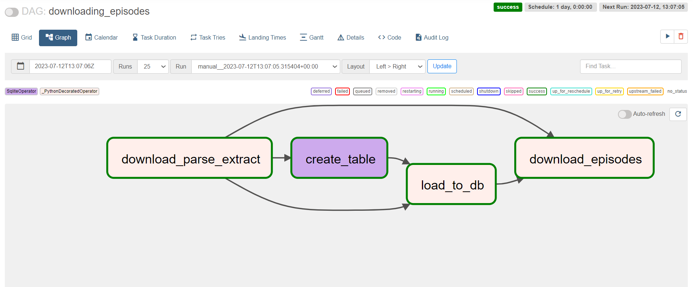

## AIRFLOW DATA PIPELINE TO DOWNLOAD PODCASTS
build a four-step data pipeline using Airflow, which is a popular, Python-based data engineering tool for defining and running very powerful and flexible data pipelines. The pipeline will download podcast episodes.

## PREREQUISITES
Install the following locally:

- Python 3.8+
- Airflow 2.3+
Ensure that you have access to the Airflow web interface after installing it by running airflow standalone.

use the [constraints file](constraints) to setup the airflow locally in a venv

Explore some DAGs (directed acyclic graphs) or data pipelines in the Airflow web interface.

Python packages: install the required packages using the [requirements file](requirements.txt)

## RUNNING THE DAGS

Ensure that your dags are present in the dags folder of `$AIRFLOW_HOME`.
If the webserver ad scheduler are running you can view trigger your dags at `localhost:8080`

[podcasts pipeline](dags/podcasts_pipeline.py)
This code creates a DAG (Directed Acyclic Graph) in Airflow with a single task to download, parse, and extract the list of episodes from the Marketplace podcast metadata. The DAG is scheduled to run once a day and will not catch up for missed runs. The `download_parse_extract` task uses the requests library to download the metadata from the specified URL, then uses `xmltodict` to parse the XML data and extract the list of episodes.

[pipeline with database](dags/pipeline_with_database.py)
This code adds a new task to Airflow pipeline using the `SqliteOperator` to create a table in a SQLite database. The `create_table` task uses the sqlite_default connection ID to connect to the SQLite database and runs an SQL command to create a table named episodes with the specified fields if it doesn’t already exist.

[storing data to db](dags/storing_data_pipeline.py)
This code adds a new task to Airflow pipeline using the @task decorator to store the episode metadata into the SQLite database.The `load_to_db` task uses the SqliteHook to connect to the SQLite database and query it to determine which episodes are already stored. It then loops through the list of episodes and inserts new rows into the episodes table for any episodes that are not already stored.

[checking sqlite database](dags/check_database_contents.py)
This code creates a new DAG in Airflow named `check_sqlite_database` with a single task that checks the contents of the SQLite database and logs the results. The `check_database` function uses the `SqliteHook` to connect to the `SQLite` database and query it to retrieve all rows from the `episodes` table. It then loops through the rows and prints each one.

[downloading podcasts episodes](dags/downloading_podcasts_epidodes.py)
This code adds a new task to Airflow pipeline using the @task decorator to download the actual podcast episodes. The `download_episodes` task loops through the list of episodes and for each episode, it creates a `filename` and `filepath` for the corresponding audio file. If the audio file does not already exist, it uses the `requests` library to download it from the specified URL and saves it to the specified filepath.

## NEXT STEPS
You can customize this project in the following ways

- Schedule the project to run daily, so we'll have a new episode when it goes live.

- Parallelize tasks and run them in the cloud.

- Add speech recognition, summaries using Airflow.

## CONTRIBUTING

Contributions are welcome! If you have any ideas, improvements, or bug fixes, please open an issue or submit a pull request.

## LICENSE

This project is licensed under the [MIT License](LICENSE).

